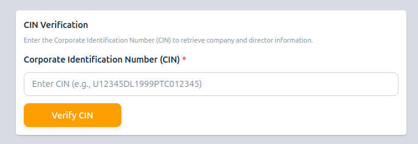
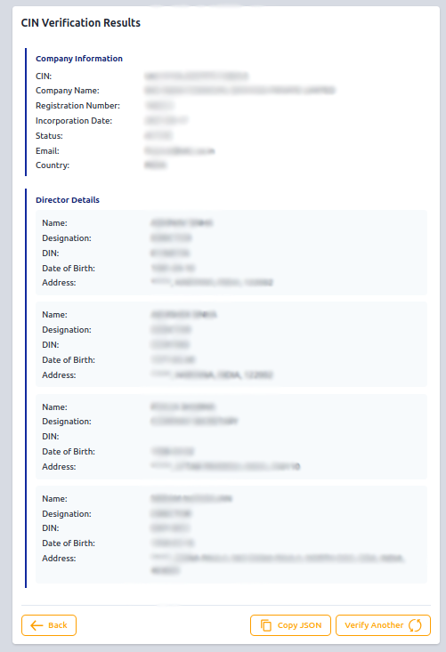
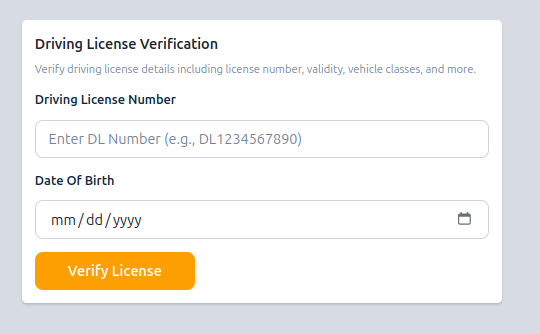
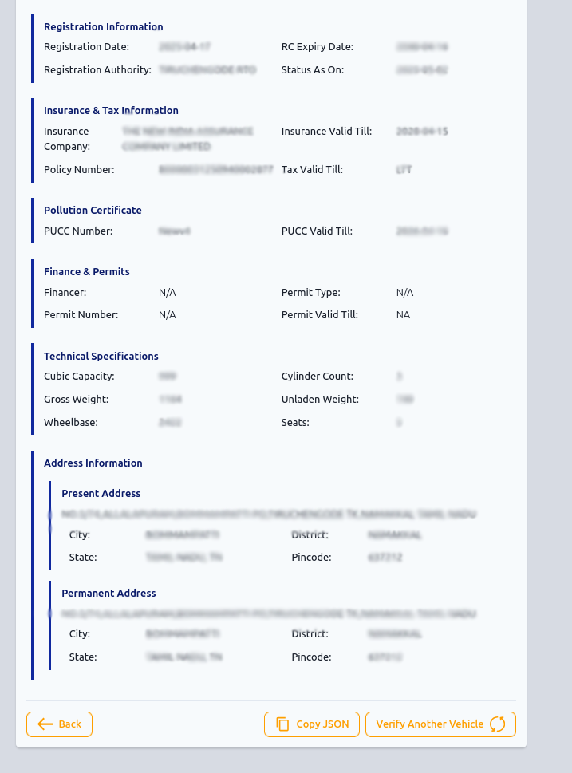
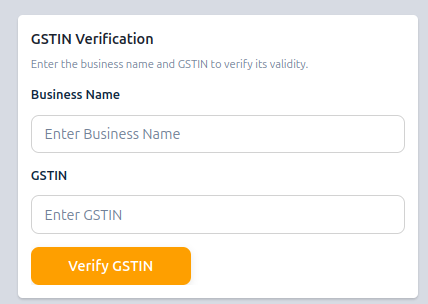
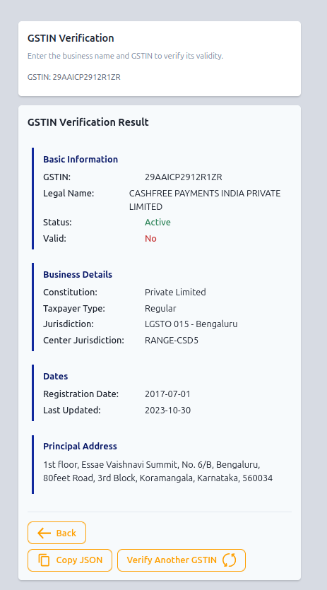
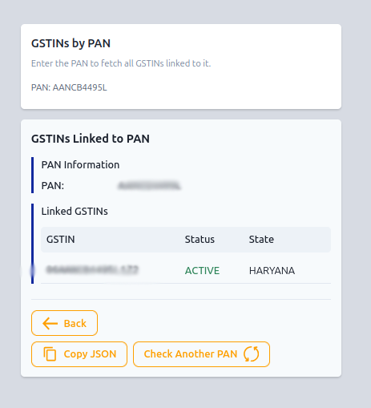

## How to verify PAN ?

### PAN Lite

#### What is PAN Lite Verification?
PAN Lite Verification is a basic process that validates a user’s PAN number, name, and date of birth against the official database. It provides key details such as PAN status, name and DOB match results, and Aadhaar linking status.

##### Form Input
1. In the **PAN Number** field, enter the 10-character PAN (e.g., `ABCDE1234F`).
2. In the **Full Name** field, enter the cardholder’s name exactly as printed on the PAN.
3. In the **Date Of Birth** field, click the calendar icon and select the user’s DOB.
4. Click the **Verify PAN** button to submit.

##### Result
- The results card displays all the detailed PAN holder information at a glance—including PAN, Name, DOB, match statuses, contact details, KYC status.
- Please refer to the content table below.

| Name                   | Description                                                                 |
|------------------------|-----------------------------------------------------------------------------|
| Pan                    | The unique 10-character alphanumeric identifier of the individual issued by the Income Tax Department. |
| Name                   | The name of the individual as per the PAN information.                      |
| Dob                    | The date of birth of the individual as per the PAN information. The format is YYYY-MM-DD. |
| Name Match             | The result of name match verification. If the name entered matches with the name present in the PAN information, you receive Y. The possible values are ['Y', 'N', null]. |
| Dob Match              | The result of the date of birth verification. If the date of birth of the individual matches with the date of birth present in the PAN information, you receive Y. The possible values are ['Y', 'N', null]. |
| Pan Status             | The status of the PAN information. See the table below for details.         |
| Status                 | The status of PAN. Possible Values are ['VALID','INVALID'].                 |
| Aadhaar Seeding Status | Whether the individual linked the aadhaar information with PAN. The possible values are ['Y', 'R', 'NA', null]. |
| Aadhaar Seeding Status Desc | Additional information of the linking of aadhaar and PAN card.         |

##### Key Points
- **PAN Lite** verifies only the basic details: PAN number, cardholder name, and date of birth.
- **Match indicators** (`Name Match`, `DOB Match`) show `Yes` or `No`.
- **Status codes** and **Aadhaar linkage** fields help confirm whether the PAN is active and linked to Aadhaar.
- Available actions: **Back**, **Copy JSON**, **Verify Another PAN**.

### PAN Advanced

#### What is PAN Advanced Verification?
PAN Advanced Verification offers comprehensive PAN-holder details, including contact information and KYC status, going beyond basic match checks. It provides verified personal information, address, Aadhaar linkage, and more for in-depth validation.

##### Form Input
1. Enter the 10-character PAN in the **PAN Number** field.
2. Type the cardholder’s exact name in the **Full Name** field.
3. Select the user’s birth date via the **Date Of Birth** calendar picker.
4. Click **Verify PAN** to fetch the advanced details.

##### Result
- The results card displays all the detailed PAN holder information at a glance—including PAN, name, DOB, match statuses, contact details, KYC status,   and any additional notes.
- Please refer to the content table below.

   | **Name**                        | **Description**                                      |
|--------------------------------|------------------------------------------------------|
| KYC Status                     | The current status of the Know Your Customer process |
| PAN Advanced Verification Result | The detailed result of PAN verification process      |
| Personal Information           | Section containing personal details of the individual |
| PAN Number                    | The unique Permanent Account Number issued to the individual |
| Provided Name                 | The name as provided by the individual                |
| Registered Name               | The official name registered with the PAN authority  |
| First Name                   | The first name of the individual                       |
| Last Name                    | The last name or surname of the individual             |
| Gender                       | The gender of the individual                            |
| PAN Type                     | The type/category of the PAN issued                     |
| Date of Birth                | The date of birth of the individual                     |
| Contact Information          | Section containing contact details                      |
| Full Address                 | The complete residential or mailing address            |
| Country                      | The country of residence, e.g., India                   |
| Masked Aadhaar               | Partially hidden Aadhaar number for privacy             |
| Aadhaar Linked               | Indicates whether Aadhaar is linked to the PAN (Yes/No) |

.png)

##### Key Points
- **PAN Advanced** returns everything in PAN Lite plus detailed contact info and KYC status.
- Includes extra fields such as **PAN Status Code**, **Aadhaar Seeding Status**, and a full **Aadhaar Status** description.
- Use **Back**, **Copy JSON**, or **Verify Another PAN** to navigate or export results.

---

## How to do Passport Verification?

### What is Passport Verification?
Passport Verification validates a user’s passport file number and date of birth against the government database. It confirms the passport holder’s identity and application details.

#### Form Input

- Go to the **Passport Verification** section on the portal.
- Enter the following mandatory fields:
  - **File Number** – as printed on the passport (e.g., PA1079341954215).
  - **Date of Birth** – in DD/MM/YYYY format.
- Optionally, enter the **Name** exactly as it appears on the passport.
- Click on the **Verify Passport** button to proceed.

#### Result

- After submission, the **Passport Verification Results** screen will appear.
- It displays the retrieved passport details such as file number, name, date of birth, and application info.
- Please refer to the content table below.

  | Name                     | Description                                                      |
|--------------------------|------------------------------------------------------------------|
| File Number              | Unique alphanumeric code identifying the passport application.   |
| Name                     | Name of the passport holder.                                     |
| DOB                      | Date of birth of the passport holder.                            |
| Application Type         | Type of passport application.                                    |
| Application Date| Date when the passport application was received.                 |

---

## How to do Employee Verification?

### What is Employee Verification?
Employee Verification confirms an individual’s employment details by matching submitted information with official records. It includes identity checks, UAN data, employment history, and Aadhaar verification.

#### Form Input

- You can complete any or all fields (Phone Number, PAN, UAN, Date Of Birth, Employee Name, Employer Name), but providing the **UAN** alone is sufficient.
- Once you’ve entered your data, click **Verify Employee** to submit.

#### Result

- The result screen gives a consolidated view of personal identity, employment history, recent activity, and employer verification—all tied to the UAN.
- Please refer to the content table below.

  | **Name**                    | **Description**                                                |
|-----------------------------|----------------------------------------------------------------|
| Employee Verification       | Process to verify employment information of an employee        |
| Verification Request Status | Confirmation that the verification request was successfully submitted |
| Input Details               | Section containing entered employee details for verification    |
| UAN                         | Universal Account Number of the employee                        |
| UAN Details                 | Detailed information related to the employee’s UAN             |
| Source Score                | The reliability score of the data source                        |
| Basic Details               | Section containing fundamental personal information            |
| Name                        | Full name of the employee                                       |
| Date of Birth               | Employee's date of birth                                        |
| Gender                      | Gender of the employee                                          |
| Confidence Score            | Overall confidence level in the verification results           |
| Aadhaar Verified            | Status indicating if Aadhaar has been verified                  |
| Employment Details          | Section containing employment-specific information             |
| Member ID                   | Unique membership identifier of the employee                    |
| Establishment ID            | Identifier for the employer or establishment                    |
| Employer Name               | Name of the employer or organization                            |
| Joining Date                | Date when the employee joined the organization                  |
| Employer Confidence Score   | Confidence score assigned by the employer on employee data     |
| Recent Employment Details   | Information about the latest employment status                  |
| Currently Employed          | Indicates if the employee is currently employed (Yes/No)        |

#### Key Points to Remember.

- UAN is the most reliable field for accurate verification.
- All entered fields should match official employment records.

---

## How to Verify CIN (Customer Identification Number)?

### What is CIN Verification?
CIN (Corporate Identification Number) Verification is used to retrieve verified company and director information by providing a valid CIN. It ensures accurate identification of registered companies in India and promotes transparency.

#### Form Input
- Go to the **CIN Verification** section under KYC Verification Tools.
- Enter a valid Corporate Identification Number (CIN) in the input field.
- Click the **Verify CIN** button.

#### Result
- Upon successful verification, company and director details will be displayed, including company name, registration number, incorporation date.
- Please refer to the content table below.

| Name                  | Description                                                                                  |
|-----------------------|----------------------------------------------------------------------------------------------|
| CIN                   | Entered CIN information.                                                                     |
| Company Name          | Name of the company registered under the Ministry of Corporate Affairs.                      |
| Registration Number   | Registration number of the company.                                                          |
| Incorporation Date    | Date of incorporation of the company.                                                        |
| CIN Status            | Granular level status of the CIN information.                                                |
| Email                 | Email ID of the company registered under the Ministry of Corporate Affairs.                  |
| Country               | Country where the company is located.                                                        |
| Director Details      | Details of the directors associated with the company, each containing:                       |
|                       | 1. DOB – Date of birth of the director                                                       |
|                       | 2. Designation – Designation of the director                                                 |
|                       | 3. Address – Address information of the director                                             |
|                       | 4. DIN – Unique identification number assigned to the individual appointed as director       |
|                       | 5. Name – Name of the director                                                               |

#### Key Points.
- Ensure the CIN entered is correct and in the valid format.
- CIN format includes the listing status, industry code, state code, year of incorporation, ownership type, and registration number.
- This tool only works for companies registered with the Ministry of Corporate Affairs (MCA).

---

## How to Verify a Driving License?

### What is Driving License Verification?
Driving License Verification is used to authenticate a driving license by validating key information such as license number, date of birth, vehicle class, and validity details. It plays a crucial role in KYC and onboarding processes.

#### Form Input

1. Enter the **Driving License Number**
2. Enter the **Date of Birth** in `mm/dd/yyyy` format.
3. Click on the **Verify License** button.

#### Result

- This screen displays the verified license details, including personal information, license status, validity period, address, and authorized vehicles.
- Please refer to the content table below.

| Name                      | Description                                                                                          |
|---------------------------|------------------------------------------------------------------------------------------------------|
| DL Number                 | The unique number assigned to the driving licence.                                                   |
| DOB                       | The date of birth of the individual as present in the driving licence.                              |
| Status                    | Whether the driving licence is valid.                                                               |
| Badge Details             | Details of badges associated with the driving licence, each containing:                             |
|                           | 1. Badge Issue Date – The date the badge was issued                                                 |
|                           | 2. Badge No – The number of the badge issued                                                       |
|                           | 3. Class of Vehicle – The class of the vehicle                                                     |
| DL Validity               | Information regarding the validity of the licence, including:                                       |
|                           | 1. Non Transport – Validity period (`from` and `to` dates)                                         |
|                           | 2. Transport – Validity period (`from` and `to` dates)                                             |
|                           | 3. Hazardous Valid Till – Validity for hazardous vehicle driving                                   |
|                           | 4. Hill Valid Till – Validity for driving in hill and mountain regions                             |
| Details of Driving Licence| Detailed information about the driving licence, including:                                         |
|                           | 1. Date of Issue – The date when the driving licence was issued                                    |
|                           | 2. Date of Last Transaction – The date of the last transaction                                     |
|                           | 3. Status – The current status of the driving licence                                              |
|                           | 4. Last Transacted At – The date of the last transaction recorded                                  |
|                           | 5. Name – The name of the individual                                                               |
|                           | 6. Father or Husband Name – The father’s or husband’s name of the individual                       |
|                           | 7. Address List – List of addresses with `complete_address`, `type`, and `split_address`           |
|                           | 8. Address – The address string                                                                    |
|                           | 9. Photo – The photo of the individual                                                             |
|                           | 10. COV Details – The details of the class of vehicle (COV)                                        |

.png)

You can then choose to:
- Click **Back** to return to the input form.
- Click **Copy JSON** to grab the raw response.
- Click **Verify Another license** to start a new check.

#### Key Points to Remember.

- Ensure the driving license number is correctly formatted (e.g., `DL12345678XX`).
- The date of birth must match exactly as per the license records.

---

## How to Verify Vehicle RC (Registration Certificate)?

### What is Vehicle RC Verification?
Vehicle RC Verification is used to authenticate and retrieve the registration details of a vehicle using its registration number. This helps confirm the legitimacy, ownership, and legal status of the vehicle—crucial for compliance and KYC processes.

#### Form Input

1. Enter the **Vehicle Registration Number** (e.g., `DL1234567890`).
2. Click on the **Verify Vehicle RC** button to proceed.

#### Result

- This screen displays the key registration details of the vehicle, such as owner name, registration date, vehicle class, fuel type, and validity.
- Please refer to the content table below.

| Name                      | Description                                                                                          |
|---------------------------|------------------------------------------------------------------------------------------------------|
| Reference Id              | The unique ID created for reference purposes.                                                       |
| Status                   | The status of the vehicle RC information.                                                           |
| Reg No                   | The registration number of the vehicle.                                                             |
| Class                    | The category or type of the vehicle as recognised by the relevant transportation authorities.       |
| Chassis                  | The chassis information of the vehicle.                                                             |
| Engine                   | The engine number of the vehicle.                                                                    |
| Vehicle Manufacturer Name| The manufacturer of the vehicle.                                                                     |
| Model                    | The model number of the vehicle.                                                                     |
| Vehicle Color            | The colour of the vehicle.                                                                            |
| Type                     | The type of the vehicle.                                                                              |
| Norms Type               | The norms set by the Central Pollution Control Board (CPCB).                                         |
| Body Type                | The body type of the vehicle.                                                                         |
| Owner Count              | The number of owners of the vehicle.                                                                  |
| Owner                    | The name of the current owner of the vehicle.                                                        |
| Owner Father Name        | The father's name of the current owner of the vehicle.                                               |
| Mobile Number            | The mobile number of the current owner of the vehicle.                                               |
| Rc Status                | The status of the RC.                                                                                 |
| Status As On             | The particular date of the status of the RC.                                                         |
| Reg Authority            | The name of the registration authority.                                                              |
| Reg Date                 | The date of registration of the vehicle.                                                             |
| Vehicle Manufacturing Month Year | The month and year of the manufacturing of the vehicle.                                        |
| Rc Expiry Date           | The date until which the registration of the vehicle is valid.                                       |
| Vehicle Tax Upto         | The date until which the tax paid by the owner for the vehicle is valid.                             |
| Vehicle Insurance Company Name | The name of the insurance company associated with the vehicle.                                |
| Vehicle Insurance Upto   | The date until which the insurance paid by the owner for the vehicle is valid.                       |
| Vehicle Insurance Policy Number | The insurance policy number of the vehicle.                                                    |
| Rc Financer              | The name of the financial institution or lender that provided financing for the vehicle.             |
| Present Address          | The current address of the owner of the vehicle.                                                     |
| Split Present Address    | It contains the address information in individual components.                                        |
| Permanent Address        | The permanent address of the owner of the vehicle.                                                   |
| Split Permanent Address  | It contains the address information in individual components.                                        |
| Vehicle Cubic Capacity   | The cubic capacity of the vehicle's engine.                                                          |
| Gross Vehicle Weight     | The gross weight of the vehicle in kilograms.                                                        |
| Unladen Weight           | The weight of the vehicle without carrying any load in kilograms.                                    |
| Vehicle Category         | The category of the vehicle.                                                                          |
| Rc Standard Cap          |                                                                                                      |
| Vehicle Cylinders No     | The number of cylinders present in the vehicle.                                                      |
| Vehicle Seat Capacity    | The number of seats in the vehicle.                                                                  |
| Vehicle Sleeper Capacity | The number of beds available in the vehicle.                                                         |
| Vehicle Standing Capacity| The number of people that can stand in the vehicle.                                                  |
| Wheelbase                | The distance between the front and rear axles of a vehicle in mm.                                    |
| Vehicle Number           | The registration number of the vehicle.                                                              |
| Pucc Number              | The Pollution Under Control Certificate (PUCC) number associated with the vehicle.                   |
| Pucc Upto                | It displays till when the PUCC number is valid.                                                      |
| Blacklist Status         | It displays whether the vehicle is blacklisted.                                                      |
| Blacklist Details        | The reasons for blacklisting the vehicle. (Has additional fields)                                    |
| Challan Details          | It displays traffic tickets or citations issued by traffic authorities for violations. (Has additional fields) |
| Permit Issue Date        | It displays when the relevant authorities granted permission for a permit associated with the vehicle.|
| Permit Number            | The permit number of the vehicle.                                                                     |
| Permit Type              | The type of permit issued to the vehicle.                                                            |
| Permit Valid From        | The beginning date of the issuance of permit.                                                        |
| Permit Valid Upto        | The end date of the permit.                                                                           |
| Non Use Status           | It displays whether the vehicle owner or registrant declared that the vehicle is not in use for a period. |
| Non Use From             | The beginning date of the non-use period.                                                            |
| Non Use To               | The end date of the non-use period.                                                                   |
| National Permit Number   | The permit issued to the vehicle to go outside the home state carrying goods.                         |
| National Permit Upto     | The end date of the permit issued to the vehicle to go outside the home state.                       |
| National Permit Issued By| The national permit issuer's name.                                                                    |
| Is Commercial            | It displays whether the vehicle is for commercial purposes.                                          |
| Noc Details              | The details of the no objection certificate.                                                         |

You can then choose to:
- Click **Back** to return to the input form.
- Click **Copy JSON** to grab the raw response.
- Click **Verify Another Vehicle** to start a new check.

#### Key Points to Remember.

- Ensure the vehicle registration number is correctly formatted (e.g., `DL1234567890`).
- This tool helps verify official registration details quickly.
- Always double-check the number entered for accuracy.

---

## How to Verify Voter ID?

### What is Voter ID Verification?
Voter ID Verification confirms the validity of an individual’s Electoral Photo Identity Card (EPIC) number by checking it against the election commission's database. This verification includes personal, constituency, and polling station details.

#### Form Input

- Go to the **Voter ID Verification** section on the portal.
- Enter the following mandatory field:
  - **EPIC Number** – as printed on the Voter ID card (e.g., TXL1456136).
- Optionally, enter the **Name** of the voter for additional verification.
- Click on the **Verify Voter ID** button to proceed.

#### Result

- After submission, the **Voter ID Verification Result** screen will appear.
- It displays the verified voter details such as name, age, gender, father’s name, address, and constituency information.
- Please refer to the content table below.

  | Name                             | Description                                                                                   |
|----------------------------------|-----------------------------------------------------------------------------------------------|
| Name                             | Name of the individual as present in the voter ID card.                                       |
| Name in Regional Language        | Name of the individual in the individual’s regional language as present in the voter ID card. |
| Age                              | Age of the voter ID holder as present in the voter ID card.                                   |
| Father Name                      | Father’s name of the individual as present in the voter ID card.                              |
| Father Name in Regional Language | Father’s name in the individual’s regional language as present in the voter ID card.          |
| DOB                              | Date of birth of the individual as present in the voter ID card.                              |
| Gender                           | Gender of the individual as present in the voter ID card.                                     |
| Address                          | Address of the individual as present in the voter ID card.                                    |
| Split Address                    | Address information of the individual in separate components. (Has additional fields)         |
| EPIC Number                      | EPIC number of the individual as present in the voter ID card.                                |
| State                            | Name of the state as present in the voter ID card.                                            |
| Assembly Constituency Number     | Number associated with the assembly constituency as present in the voter ID card.             |
| Assembly Constituency            | Name of the assembly constituency as present in the voter ID card.                            |
| Parliamentary Constituency Number | Number associated with the parliamentary constituency as present in the voter ID card.        |
| Parliamentary Constituency       | Name of the parliamentary constituency as present in the voter ID card.                       |
| Part Details                     | Combination of part number and part name in the electoral roll.                               |
| Serial Number                    | Serial number as present in the voter ID card.                                                |
| Polling Station                  | Place where the individual cast votes during elections.                                       |

#### Key Points to Remember.

- Ensure the EPIC number is correctly entered as it appears on the Voter ID card.
- The name field is optional but can improve result accuracy.
- This tool helps verify official voter registration details quickly and reliably.
- Always double-check the EPIC number for typos before submission.

---

## How to Verify GSTIN?

### GSTIN Verfication.

### What is GSTIN Verification?
GSTIN Verification validates a business’s Goods and Services Tax Identification Number (GSTIN) by cross-referencing it with the official GST database. It confirms the authenticity, registration status, and associated details of the business.

##### Form Input

- Go to the **GSTIN Verification** section on the portal.
- Enter the following mandatory fields:
  - **Business Name** – as registered for GST.
  - **GSTIN** – the 15-digit GST number (e.g., 06AANCB4495L1Z2).
- Click on the **Verify GSTIN** button to proceed.

##### Result

- After submission, the **GSTIN Verification Result** screen will appear.
- It displays the verified GST details such as business name, registration status, GSTIN, state, and registration type.
- Please refer to the content table below.

  | **Name**                     | **Description**                                                                                   |
|-----------------------------|---------------------------------------------------------------------------------------------------|
| GSTIN                       | The Goods and Services Tax Identification Number of the business.                                |
| Legal Name of Business      | The legal name of the business as registered under GST.                                          |
| GSTIN Status                | The current status of the GSTIN (e.g., Active, Cancelled).                                       |
| Valid                       | Indicates whether the GSTIN is valid (true or false).                                            |
| Constitution of Business    | The type or constitution of the business (e.g., Private Limited, Proprietorship, etc.).          |
| Taxpayer Type               | The type of taxpayer (e.g., Regular, Composition, Casual).                                       |
| State Jurisdiction          | The name of the state-level tax office that has jurisdiction over the business.                 |
| Center Jurisdiction         | The name of the central tax office that has jurisdiction over the business.                     |
| Date of Registration        | The date when the business was registered under GST.                                             |
| Last Update Date            | The most recent date on which the GSTIN details were updated.                                   |
| Principal Place Address     | The primary address of the business as registered under GST.                                     |

##### Key Points to Remember

- Ensure both GSTIN and business name are entered correctly.
- The tool only validates GSTINs that are currently active.
- Helps confirm whether a business is officially registered under GST.
- Double-check the GSTIN for typing errors before verifying.

### Fetch GSTINs linked to a PAN.

#### What is GSTINs by PAN?
The GSTINs by PAN tool enables retrieval of all active GST registrations linked to a specific Permanent Account Number (PAN). This helps identify every business entity registered under that PAN across different states or jurisdictions.

##### Form Input

- Go to the **GSTINs by PAN** section on the portal.
- Enter the following mandatory field:
  - **PAN** – the 10-character PAN (e.g., AANCB449XL).
- Click on the **Fetch GSTINs** button to proceed.

##### Result

- After submission, the **GSTINs by PAN Result** screen will appear.
- It displays all GSTINs linked to the entered PAN along with their registration status, type, and state.
- Please refer to the content table below.

| **Name**                 | **Description**                                                  |
|--------------------------|------------------------------------------------------------------|
| Pan                      | The entered PAN information in the request                       |
| Gstin List               | The list of GSTIN associated with the entered PAN                |
| Gstin        | The GSTIN information                                            |
| Status       | The status of the GSTIN associated with the entered PAN          |
| State        | The name of the state                                            |

##### Key Points to Remember.

- Enter the PAN exactly as it appears in official documents.
- Only GSTINs currently registered and active will be shown.
- Useful for auditing, compliance checks, and verifying business presence across states.

