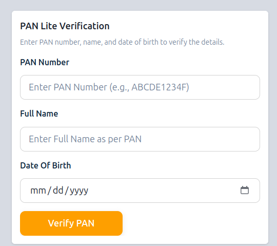
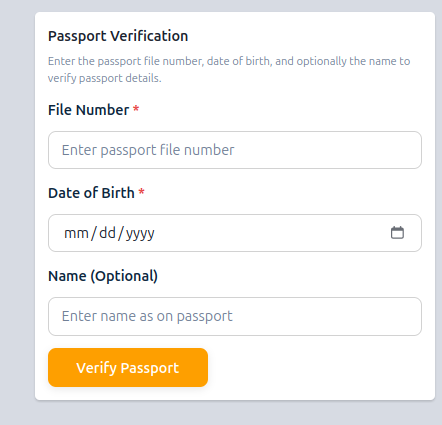
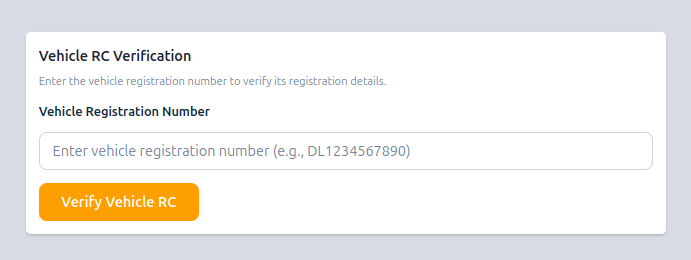
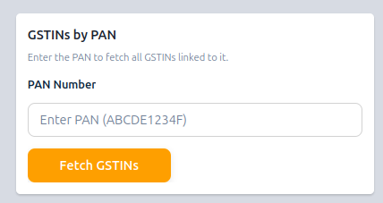

## how to verify PAN ?

## What is PAN Lite Verification?
PAN Lite verification is the basic level of PAN (Permanent Account Number) validation. It allows you to confirm a user’s PAN number, name, and date of birth against the authoritative database.

### Step 1: Verify Basic PAN Details
1. In the **PAN Number** field, enter the 10-character PAN (e.g., `ABCDE1234F`).
2. In the **Full Name** field, enter the cardholder’s name exactly as printed on the PAN.
3. In the **Date Of Birth** field, click the calendar icon and select the user’s DOB.
4. Click the **Verify PAN** button to submit.
 

### Step 2: Review PAN Lite Verification Results
1. The results card displays all key verification details at a glance—PAN, cardholder name, DOB, match statuses, status codes, and Aadhaar linkage.
2. Choose your next action:
   - Click **Back** to return to the PAN Lite input form.
   - Click **Copy JSON** to copy the raw JSON response for further processing.
   - Click **Verify Another PAN** to clear the form and verify a different PAN.

## Key Points
- **PAN Lite** verifies only the basic details: PAN number, cardholder name, and date of birth.  
- **Match indicators** (`Name Match`, `DOB Match`) show `Yes` or `No`.  
- **Status codes** and **Aadhaar linkage** fields help confirm whether the PAN is active and linked to Aadhaar.  
- Available actions: **Back**, **Copy JSON**, **Verify Another PAN**.

## how to verify PAN advanced?

## What is PAN Advanced Verification?
PAN Advanced verification provides detailed PAN-holder information—including contact details and KYC status—beyond the basic match checks.

### Step 1: Enter PAN Advanced Details
1. Enter the 10-character PAN in the **PAN Number** field.
2. Type the cardholder’s exact name in the **Full Name** field.
3. Select the user’s birth date via the **Date Of Birth** calendar picker.
4. Click **Verify PAN** to fetch the advanced details.
  

### Step 2: Review PAN Advanced Verification Results
1. The results card displays all the detailed PAN holder information at a glance—including PAN, name, DOB, match statuses, contact details, KYC status, and any additional notes.
2. Choose your next action:
   - Click **Back** to return to the PAN Advanced input form.
   - Click **Copy JSON** to copy the raw JSON response for downstream processing.
   - Click **Verify Another PAN** to clear the form and start a new verification.

.png)

## Key Points
- **PAN Advanced** returns everything in PAN Lite plus detailed contact info and KYC status.  
- Includes extra fields such as **PAN Status Code**, **Aadhaar Seeding Status**, and a full **Aadhaar Status** description.  
- Use **Back**, **Copy JSON**, or **Verify Another PAN** to navigate or export results.  

## how to do passport verification?

## What is Passport Verification?
Passport verification checks the validity of a user’s passport file number and DOB against the government database.

### Step 1: Enter Passport Details

- Go to the **Passport Verification** section on the portal.
- Enter the following mandatory fields:
  - **File Number** – as printed on the passport (e.g., PA1079341954215).
  - **Date of Birth** – in DD/MM/YYYY format.
- Optionally, enter the **Name** exactly as it appears on the passport.
- Click on the **Verify Passport** button to proceed.

### Step 2: View Verification Results

- After submission, the **Passport Verification Results** screen will appear.
- It displays the retrieved passport details such as file number, name, date of birth, and application info.
- You can:
  - Click **Copy JSON** to copy the verification data.
  - Click **Verify Another** to start a new verification.
  - Click **Back** to return to the previous screen.

## how to do employee verification?

## What is Employee Verification?
Employee verification checks an individual’s employment details against the database.

### Step 1: Enter Employee Details

- You can complete any or all fields (Phone Number, PAN, UAN, Date Of Birth, Employee Name, Employer Name), but providing the **UAN** alone is sufficient.
- Once you’ve entered your data, click **Verify Employee** to submit.

### Step 2: View Verification Results

- The result screen gives a consolidated view of personal identity, employment history, recent activity, and employer verification—all tied to the UAN.
- You can then choose to:
  - Click **Back** to return to the input form.
  - Click **Copy JSON** to grab the raw response.
  - Click **Verify Another Employee** to start a new check.

## Key Points to Remember

- UAN is the most reliable field for accurate verification.
- All entered fields should match official employment records.

## how to verify CIN (customer identification number)?

## What is CIN Verification?
CIN (Corporate Identification Number) Verification is a process to retrieve company and director information by entering a valid CIN number. This ensures transparency and accurate identification of registered companies in India.

### Step 1: Verify CIN
- Go to the **CIN Verification** section under KYC Verification Tools.
- Enter a valid Corporate Identification Number (CIN) in the input field.
- Click the **Verify CIN** button.

### Step 2 Result Screen
- Upon successful verification, company and director details will be displayed, including company name, registration number, incorporation date, and a list of directors.

## Key Points
- Ensure the CIN entered is correct and in the valid format.
- CIN format includes the listing status, industry code, state code, year of incorporation, ownership type, and registration number.
- This tool only works for companies registered with the Ministry of Corporate Affairs (MCA).

## how to verify a driving license?

## What is Driving License Verification?

Driving License Verification is a tool used to confirm the authenticity of a driving license by checking details such as license number, date of birth, validity period, and vehicle class information. It is widely used during KYC and onboarding processes.

### Step 1: Follow Steps to Verify a Driving License

1. Enter the **Driving License Number** 
2. Enter the **Date of Birth** in `mm/dd/yyyy` format.
3. Click on the **Verify License** button.

### Step 2: Result Screen

- This screen displays the verified license details, including personal information, license status, validity period, address, and authorized vehicles.

.png)

You can then choose to:
- Click **Back** to return to the input form.
- Click **Copy JSON** to grab the raw response.
- Click **Verify Another license** to start a new check.

## Key Points to Remember

- Ensure the driving license number is correctly formatted (e.g., `DL12345678XX`).
- The date of birth must match exactly as per the license records.

## how to verify vehicle RC?

## What is Vehicle RC Verification?

Vehicle RC verification is a tool used to check the registration details of a vehicle by entering its registration number. It helps confirm the authenticity and correctness of the vehicle's registration information.

### Step 1: Enter Vehicle Registration Details

1. Enter the **Vehicle Registration Number** (e.g., `DL1234567890`).
2. Click on the **Verify Vehicle RC** button to proceed.

### Step 2: View Verification Results

- This screen displays the key registration details of the vehicle, such as owner name, registration date, vehicle class, fuel type, and validity. It    confirms whether the RC is active and accurate.

You can then choose to:
- Click **Back** to return to the input form.
- Click **Copy JSON** to grab the raw response.
- Click **Verify Another Vehicle** to start a new check.

## Key Points to Remember

- Ensure the vehicle registration number is correctly formatted (e.g., `DL1234567890`).
- This tool helps verify official registration details quickly.
- Always double-check the number entered for accuracy.

## how to verify voter ID?

## What is Voter ID Verification?

Voter ID verification checks the validity of a voter’s Electoral Photo Identity Card (EPIC) number against the official election database. It helps confirm the authenticity of voter details and constituency information.

### Step 1: Enter Voter ID Details

- Go to the **Voter ID Verification** section on the portal.
- Enter the following mandatory field:
  - **EPIC Number** – as printed on the Voter ID card (e.g., TXL1456136).
- Optionally, enter the **Name** of the voter for additional verification.
- Click on the **Verify Voter ID** button to proceed.

### Step 2: View Verification Results

- After submission, the **Voter ID Verification Result** screen will appear.
- It displays the verified voter details such as name, age, gender, father’s name, address, and constituency information.
- You can:
  - Click **Copy JSON** to copy the verification data.
  - Click **Verify Another Voter ID** to start a new verification.
  - Click **Back** to return to the previous screen.

## Key Points to Remember

- Ensure the EPIC number is correctly entered as it appears on the Voter ID card.
- The name field is optional but can improve result accuracy.
- This tool helps verify official voter registration details quickly and reliably.
- Always double-check the EPIC number for typos before submission.

## how to verify GSTIN?

## What is GSTIN Verification?

GSTIN verification checks the validity of a business’s Goods and Services Tax Identification Number (GSTIN) against the official GST database. It confirms whether a GSTIN is active and correctly registered under the entered business name.

### Step 1: Enter Business Details

- Go to the **GSTIN Verification** section on the portal.
- Enter the following mandatory fields:
  - **Business Name** – as registered for GST.
  - **GSTIN** – the 15-digit GST number (e.g., 06AANCB4495L1Z2).
- Click on the **Verify GSTIN** button to proceed.

### Step 2: View Verification Results

- After submission, the **GSTIN Verification Result** screen will appear.
- It displays the verified GST details such as business name, registration status, GSTIN, state, and registration type.
- You can:
  - Click **Copy JSON** to copy the verification data.
  - Click **Verify Another GSTIN** to start a new verification.
  - Click **Back** to return to the previous screen.

## Key Points to Remember

- Ensure both GSTIN and business name are entered correctly.
- The tool only validates GSTINs that are currently active.
- Helps confirm whether a business is officially registered under GST.
- Double-check the GSTIN for typing errors before verifying.

## What is GSTINs by PAN?

The GSTINs by PAN tool allows users to retrieve all active GST registrations associated with a specific Permanent Account Number (PAN). It helps identify all businesses registered under a single PAN.

## how to fetch GSTINs linked to a PAN?

### Step 1: Enter PAN Details

- Go to the **GSTINs by PAN** section on the portal.
- Enter the following mandatory field:
  - **PAN** – the 10-character PAN (e.g., AANCB449XL).
- Click on the **Fetch GSTINs** button to proceed.

### Step 2: View GSTINs Linked to PAN

- After submission, the **GSTINs by PAN Result** screen will appear.
- It displays all GSTINs linked to the entered PAN along with their registration status, type, and state.
- You can:
  - Click **Copy JSON** to copy the GSTIN list.
  - Click **Check Another PAN** to start a new lookup.
  - Click **Back** to return to the previous screen.

## Key Points to Remember

- Enter the PAN exactly as it appears in official documents.
- Only GSTINs currently registered and active will be shown.
- Useful for auditing, compliance checks, and verifying business presence across states.

